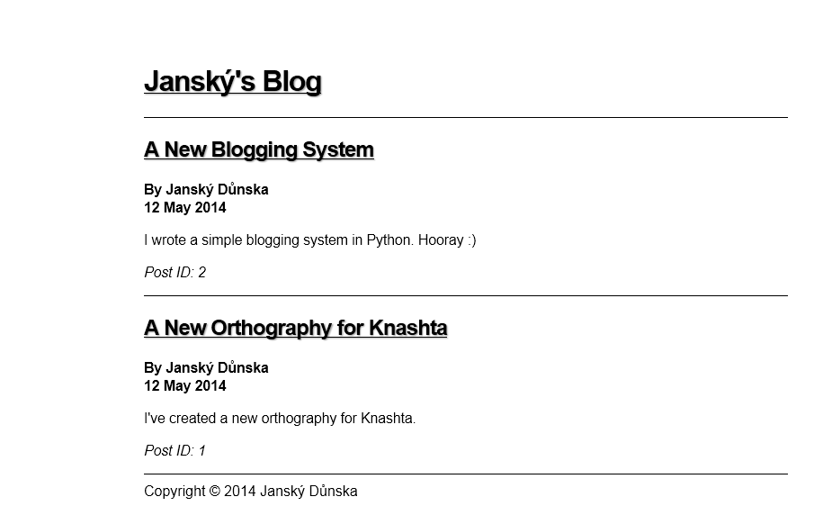

# JanskyBlog

This is a simple blogging system written in Python for CGI.

It's for Python 2.7 (at least, that's all I've tried to run it on).

## Features

* Flat-file post system (more info below)
* Template system (look at provided template for more info, modify it to suit your needs)

## Post Format

It's a very simple format

	name=Post Title
	author=Post Author
	id=Post ID (a number)
	date=Post Date Published (e.g. 12 May 2014)
	blurb=This will appear on the post lists page.
	---
	
Post content in HTML

## Organization of Posts

Posts are organized according to IDs, not dates. Posts with higher IDs appear first in the post list.

## What does it look like?

Here is my blog, which uses the provided template:

## License

JanskyBlog is licensed under the MIT license (see LICENSE.txt for more information).

